# Databricks TPC-DI

A Databricks-native implementation of the [TPC-DI](http://tpc.org/tpcdi/default5.asp) data-integration benchmark, designed to run end-to-end on the Databricks Lakehouse platform across multiple compute SKUs (job clusters, SQL warehouses, Spark Declarative Pipelines) and multiple data-load shapes (single-batch, incremental, and a 730-day daily-streaming "Augmented Incremental" variant).

This repo follows the [TPC-DI v1.1.0 spec](https://www.tpc.org/TPC_Documents_Current_Versions/pdf/TPC-DI_v1.1.0.pdf) for business rules and table outputs; the spec itself does not provide code, only requirements. This project is the implementation.

[](https://docs.databricks.com/release-notes/runtime/releases.html)
[](http://tpc.org/tpcdi/default5.asp)

## Notable changes vs the original DIGen-only pipeline

- **Distributed Spark data generator** (`src/tools/spark_data_generator.py` + `src/tools/tpcdi_gen/`) — replaces the single-threaded `DIGen.jar` with a parallel PySpark implementation that runs on Databricks Serverless. Linear scaling across executors; large scale factors (SF=10000+) finish in a fraction of the JAR's time. The DIGen.jar path is preserved for byte-compatible reference output.
- **SDP** (Spark Declarative Pipelines) — the runtime previously branded "DLT". Library names, schema labels, and prose all reflect the rename.
- **Augmented Incremental benchmark** — a 730-day daily-streaming reshaping of TPC-DI (2015-07-06 → 2017-07-05) that exercises CDC + SCD2 maintenance under a real production-shaped daily load instead of a single bulk import. Available for Cluster and SDP.
- **Python workflow builders** — every job/pipeline JSON is built by a Python module under `src/tools/workflow_builders/`. Jinja templates retired.
- **Static audit snapshots** — pre-computed `*_audit.csv` snapshots committed to the repo at every common SF, so audit values are instant rather than recomputed each run.
- **Skills-asset positioning** — this repo is deliberately curated for use by AI agents (Claude, Databricks Genie). See [`CLAUDE.md`](CLAUDE.md) at repo root for architecture context, gotchas, and load-bearing decisions.

## Flow at a glance



## Choosing a workflow — SKU × Batch Type

The Driver splits the workflow choice into two widgets so the dropdown stays short. Pick a **SKU** (compute shape) and a **Batch Type** (how data is fed in). Combinations the SKU doesn't support are hidden automatically.

| SKU \\ Batch Type | Single Batch | Incremental | Augmented Incremental |
|---|:-:|:-:|:-:|
| **Cluster** (job cluster, classic or serverless) | ✓ | ✓ | ✓ |
| **DBSQL** (serverless SQL warehouse) | ✓ | ✓ | — |
| **SDP** (Spark Declarative Pipelines) | ✓ + edition | — | ✓ |

When **SKU=SDP × Batch Type=Single Batch**, an **Edition** dropdown appears: `CORE`, `PRO` (adds `APPLY CHANGES INTO` for SCD Type 1/2), or `ADVANCED` (adds Data Quality constraints).

### Batch Type detail

- **Single Batch** — all 3 TPC-DI batches in one pass (faster, **no audit checks**).
- **Incremental** — batches sequentially with audit checks at each boundary (spec validation, CLUSTER + DBSQL only).
- **Augmented Incremental** — 730-day daily streaming pipeline (CLUSTER + SDP only). Reads pre-staged per-day files from `_staging/sf={sf}/{Dataset}/_pdate={date}/`. Stage 0 (data prep) is a separate workflow built by `workflow_builders/augmented_staging.py` — run it once per SF to populate the staging tree. Validated at SF=10/100/1000/5000/10000/20000. See [`src/incremental_batches/augmented_incremental/README.md`](src/incremental_batches/augmented_incremental/README.md) for the architecture.

## How to run

1. Open `src/TPC-DI Driver` in your Databricks workspace.
2. Run the first cell to bootstrap defaults (cloud detection, node-type catalog, DBR list, user-prefixed schema names).
3. Set the widgets:
   - **SKU** + **Batch Type** + (if SDP × Single Batch) **Edition**
   - **Scale Factor** (`10` / `100` / `1000` / `5000` / `10000` / `20000`)
   - **Job Name**, **Target Catalog**, **Target Database** — reasonable defaults.
   - **Data Generator** (`spark` default; `digen` for the legacy single-threaded path) — hidden for Augmented variants since they always use Spark-staged data.
   - **Serverless** (`YES` default) — on for everything except `Cluster` non-serverless and SDP non-serverless.
   - **Predictive Optimization**, **Optimize For UC Features or Fastest Performance**.
4. Run the next cells. The Driver creates:
   - One **datagen** job (skipped for Augmented variants).
   - One **benchmark** job (CLUSTER, DBSQL, or SDP single-batch / incremental).
   - **Or** a **parent + child + (pipeline)** trio for Augmented variants.

Each cell prints a clickable link to the created job(s).

### Job naming convention

`{base}-SF{sf}-{Batched}-{Exec}-{Gen}` for standard variants; `{base}-SF{sf}-AugmentedIncremental-{Cluster|SDP}-Parent` for the augmented parent. Each job carries a `data_generator: spark|native_jar` tag so they're filterable without parsing the name.

## Compute & sizing

### Serverless (default)
SDP pipelines, augmented variants, and the Spark datagen all run on serverless with `performance_target: PERFORMANCE_OPTIMIZED`. No DBR / node-type / cluster restrictions.

### Non-serverless Cluster (when `Serverless=NO`)
The Driver picks an ARM-preferred, local-NVMe-preferred node and sizes the cluster by SF. Cloud-aware (Azure D_v6 / L_v3, AWS Graviton m8g/m8gd/i7i, GCP c4a-lssd):

| Scale Factor | Total Raw Data | Suggested Cluster |
|---|---|---|
| 10 | ~1 GB | single-node 8-core |
| 100 | ~10 GB | single-node 8-core |
| 1000 | ~100 GB | single-node 16-core |
| 5000 | ~500 GB | 32-core driver + 5 × 16-core workers |
| 10000 | ~1 TB | 64-core driver + 10 × 16-core workers |
| 20000 | ~2 TB | 64-core driver + 20 × 16-core workers |

### DBSQL Warehouses
Auto-created if missing (serverless, sized by SF). Names are generic so multiple users can share:

| SF | Warehouse |
|---|---|
| 10 / 100 | `TPCDI_2X-Small` |
| 1000 | `TPCDI_Small` |
| 5000 | `TPCDI_Large` |
| 10000 | `TPCDI_X-Large` |

### Native DIGen.jar
Forced to a non-serverless DBR 15.4 + Photon cluster (Java subprocess can't run on serverless). The Driver provisions this automatically. Worker count scales with SF: single-node up to SF=1000; +1 worker per 1000 of SF above that.

## Data generation paths

| | Spark (default) | Native (DIGen.jar) |
|---|---|---|
| Engine | Distributed PySpark | Single-threaded Java |
| Compute | Serverless | Non-serverless DBR 15.4 + Photon |
| Output path | `…/tpcdi_volume/spark_datagen/sf={SF}/` | `…/tpcdi_volume/sf={SF}/` |
| File shape | Split (`Customer_1.txt`, `Customer_2.txt`, …) | Single (`Customer.txt`) |
| Determinism | Same SF → same row counts + audit values | Reference (byte-compatible upstream) |
| Scaling | Linear across executors | Bound by single-node throughput |

The benchmark reads either format via brace-alternation globs (`{Customer.txt,Customer_[0-9]*.txt}`) so the rest of the pipeline is identical.

Pre-flight on the native path: before any volume side effect, `digen_runner` verifies (a) `java` is callable, (b) writable scratch dir exists (`/local_disk0` preferred, `/tmp` fallback for SF≤100), (c) DBR ≤ 15.4. Hard-aborts with a "switch to SINGLE_USER access mode" hint if any check fails — no volume data is touched.

## Augmented Incremental — what's different

Standard TPC-DI is heavily skewed to a single bulk historical load — Batch 2 and Batch 3 are tiny by comparison. Augmented Incremental reshapes this into 730 daily increments (2015-07-06 → 2017-07-05), exercising CDC + SCD2 maintenance + cumulative compaction the way a production daily pipeline does.

- **Setup** clones the static dimension tables from `tpcdi_incremental_staging_{sf}` (a shared per-SF staging schema), creates per-user `_dailybatches/{wh_db}_{sf}/` and `_checkpoints/{wh_db}_{sf}/` directories, and emits a 730-day list as a job task value.
- **Loop** (via Databricks `for_each_task`): each iteration runs `simulate_filedrops` (drops one day's pre-staged files into the Autoloader watch dir) → bronze ingest fan-out → silver/gold MERGE incrementals.
- **Cleanup** is gated by a `delete_when_finished_TRUE_FALSE` condition_task; default is `FALSE` because a full 730-day run takes ~a week and you'll typically want to inspect the result tables. Set the parameter to `TRUE` per-run if you want to drop them.
- **No audit step** — the standard TPC-DI audit checks don't apply to a daily streaming model. (Future work: add row-count parity vs a known-good staged result.)

The SDP variant uses a library-swap trick (`update_pipeline_notebook`) to bulk-load history with `dlt_historical` first, then swap to `dlt_incremental` for the streaming loop. Same physical pipeline, different libraries between phases.

## Repo layout (high level)

```
src/
  TPC-DI Driver.py                            entry-point notebook
  tools/
    data_gen_tasks/data_gen.py                unified entry: digen inline; spark/augmented init+downstream gens
    data_gen_tasks/{gen,copy}_*.py            per-dataset task notebooks
    digen_runner.py                           DIGen.jar wrapper (inline-imported in native mode)
    setup_context.py                          tpcdi_config bootstrap
    workflow_builders/                        Python builders, no Jinja
      datagen_{spark,digen}.py
      workflows_{single_batch,incremental}.py
      sdp_{pipeline,workflow}.py
      augmented_{classic,sdp}.py
      warehouse.py
    cleanup_after_benchmark.sql               final cleanup task
    tpcdi_gen/                                Spark data-generator modules
      static_audits/sf={sf}/                  pre-computed audit snapshots
    augmented_staging/                        Stage 0 for Augmented Incremental
      _stage_ingestion.py                     stage_to_files() helper
      stage_files/{Dataset}.py                7 partitioned-CSV writers
      cleanup_stage0.py                       drops temp Delta + Batch1/2/3 leftovers
  incremental_batches/                        Cluster + DBSQL benchmark SQL
    bronze/ / silver/ / gold/ / audit_validation/
    augmented_incremental/                    Augmented benchmark (Cluster + SDP) — see its README
  single_batch/
    SQL/                                      single-batch Cluster + DBSQL
    spark_declarative_pipelines/              SDP variant
tests/
  test_workflow_builders.py                   builder unit tests
  smoke_run_workflows.py                      integration smoke
CLAUDE.md                                     architecture context for AI agents
```

## Requirements of Note

- Unity Catalog required for any non-`hive_metastore` catalog (and for lineage / PK-FK constraints).
- Serverless is optional but assumed for most paths; non-serverless variants need an appropriately sized cluster.
- The native DIGen.jar path requires DBR 15.4 + Photon and a `SINGLE_USER` cluster access mode for `/local_disk0` scratch.
- Augmented Incremental requires Stage 0 (the `augmented_staging` workflow) to run once per SF before the benchmark. Validated at SF=10/100/1000/5000/10000/20000.

## Notes on scoring

The TPC-DI scoring metrics haven't been modernized for cloud-native execution, and there has never been an official submission. This implementation does not publish throughput numbers. From the TPC Fair Use Policy:

> The Databricks TPC-DI is derived from the TPC-DI and as such is not comparable to published TPC-DI results. The current scoring metrics for the TPC-DI preclude any official submission for cloud-based execution and therefore the Databricks TPC-DI cannot OFFICIALLY be submitted under current scoring metrics. Databricks withholds the ability to submit an official submission to the TPC for this benchmark upon future revision of its scoring metrics. Prior to that, we maintain that this implementation follows all guidelines, rules, and audits required of the official TPC-DI specification.
